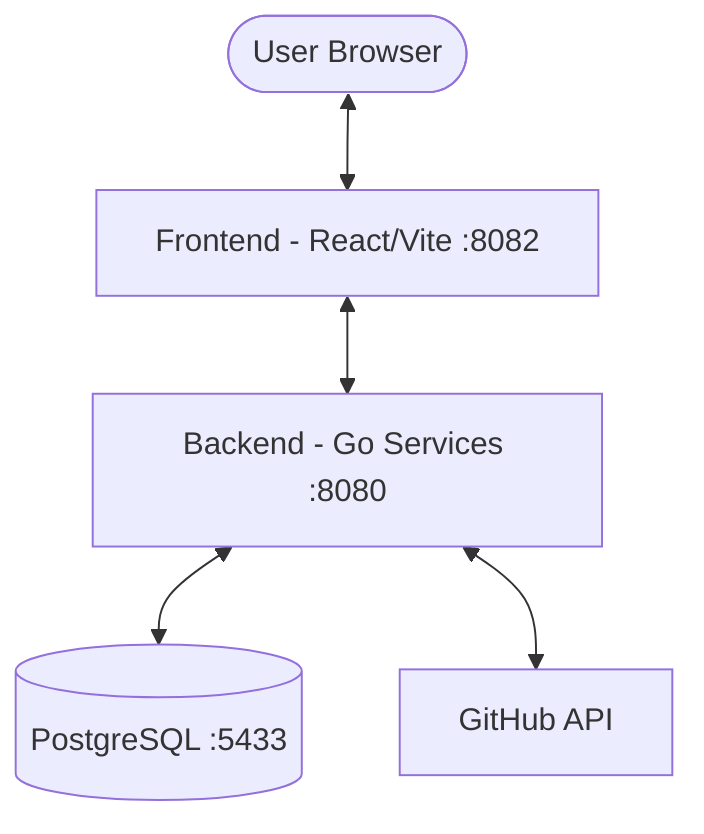

# Aegios Control Center

A modern, service-based Kubernetes security scanning and posture analysis platform. Aegios allows users to connect their GitHub repositories, scan for Kubernetes resources (including Helm charts), and analyze their security posture with AI-driven remediation suggestions.

## 🏗️ System Architecture

Aegios is built using a modern service-based architecture, consisting of a React-based frontend and a high-performance Go backend.



### Core Components
- **Frontend**: Built with React 18, TypeScript, Vite, Tailwind CSS, and Shadcn UI.
- **Backend**: Service-based architecture in Go using the Gin framework.
- **Database**: PostgreSQL for storing organization data, credentials, and scanned K8s resources.

---

## 🚀 Quick Start (Docker)

The fastest way to get Aegios running is using Docker Compose. This starts the database, backend services, and the frontend development server.

### 1. Prerequisites
- Docker & Docker Desktop
- GitHub Personal Access Token (for repository scanning)

### 2. Launch
```bash
docker-compose up --build -d
```

### 3. Access
- **Frontend UI**: [http://localhost:8082](http://localhost:8082)
- **Backend API**: [http://localhost:8080](http://localhost:8080)
- **Postgres DB**: `localhost:5433`

---

## 📁 Repository Structure

```tree
.
├── aegios-control-center-main/   # Frontend Application
│   ├── src/                     # React source code
│   └── Dockerfile               # Frontend containerization
├── github-pat-backend/          # Backend Services
│   ├── pkg/                     # Shared packages
│   ├── services/                # Service-based architecture
│   └── Dockerfile               # Backend containerization
└── docker-compose.yml           # Multi-service orchestration
```

For detailed information on each component, please refer to their respective README files:
- [Backend Documentation](./github-pat-backend/README.md)
- [Frontend Documentation](./aegios-control-center-main/README.md)

---

## 🎯 Key Features

- **🔐 Secure Auth**: User authentication with GitHub PAT verification and bcrypt hashing.
- **📁 Auto Scanning**: Automatic repository scanning for YAML and Helm files upon login.
- **🎨 K8s Processing**: Real-time rendering of Helm templates and extraction of K8s resources.
- **📊 Security Scoring**: Holistic security posture scoring (0-100) with detailed breakdowns.
- **🤖 Agentic Remediation**: NLP-driven remediation suggestions for security findings.

---

**Last Updated**: April 4, 2026
