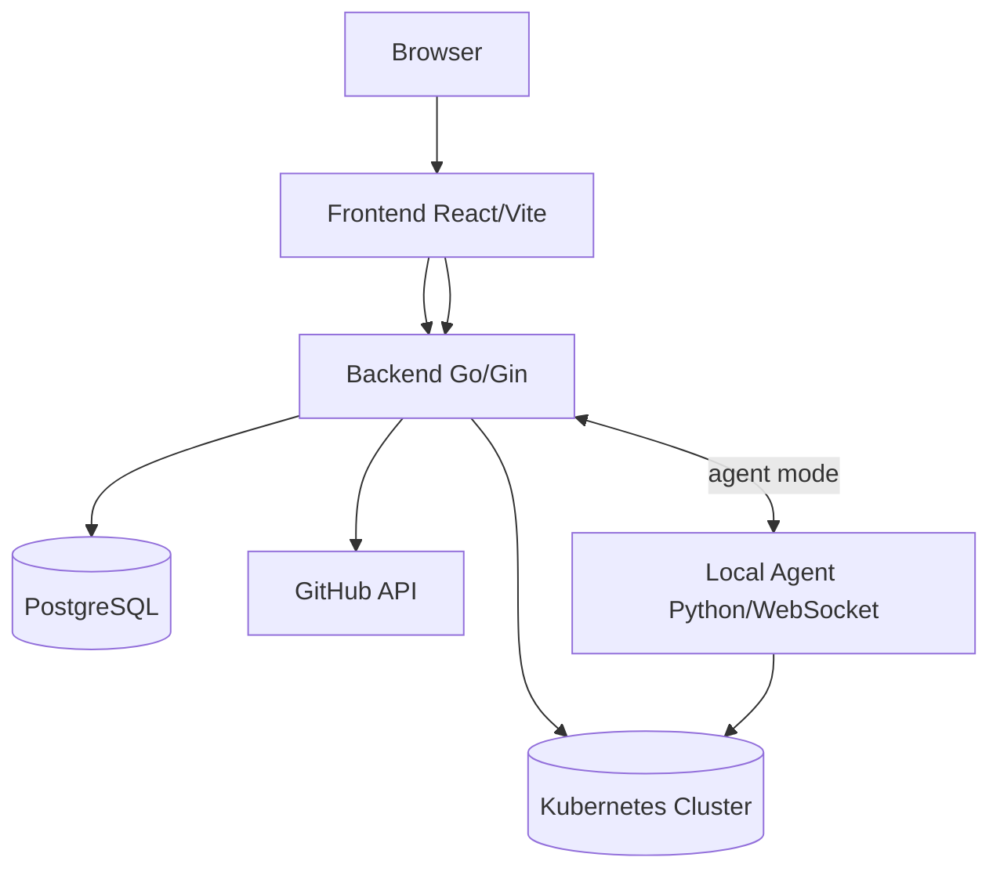

<div align="center">

  

  <h1>🛡️ Aegios</h1>
  
  <p>
    <b>A Repository-Centric Static Analysis Framework For Detecting Kubernetes Security Misconfigurations</b>
  </p>

  <p>
    Aegios is an automated Kubernetes security posture management tool that integrates seamlessly with GitHub to fetch repository data, track files, render Helm charts, and run comprehensive security validation checks against your infrastructure.
  </p>

  <p>
    <a href="https://github.com/alivevivek8/aegios/stargazers"></a>
    <a href="https://github.com/alivevivek8/aegios/issues"></a>
    <a href="https://github.com/alivevivek8/aegios/blob/main/LICENSE"></a>
  </p>

  <p>
    <a href="#about">About</a> •
    <a href="#features">Features</a> •
    <a href="#getting-started">Getting Started</a> •
    <a href="#architecture">Architecture</a>
  </p>

</div>

---

## Table of Contents
- [About](#about)
- [Features](#features)
- [Tech Stack](#tech-stack)
- [Architecture](#architecture)
- [Project Structure](#project-structure)
- [Getting Started](#getting-started)
- [Configuration](#configuration)
- [Security](#security)
- [How to Contribute?](#how-to-contribute)
- [What's Next?](#whats-next)
- [License](#license)
- [Acknowledgements](#acknowledgements)
- [Author](#author)

---

## About

Aegios is an automated Kubernetes security posture management tool that integrates seamlessly with GitHub. It fetches repository data, tracks Kubernetes-related files, renders Helm charts, and runs comprehensive security validation checks against the resulting concrete resources. By providing a centralized control center, Aegios enables DevOps and security teams to monitor their Kubernetes cluster score, investigate vulnerabilities, and apply automated, AI-driven remediation directly through a secure terminal agent or by opening GitHub pull requests.

---

## Features

- **GitHub Integration:** Authenticate with GitHub using Personal Access Tokens (PAT) to securely sync repositories and track Kubernetes infrastructure files.
- **Helm Rendering Engine:** Automatically pulls Helm charts and environment-specific values, executing `helm template` to ingest concrete Kubernetes YAML resources.
- **Comprehensive Validation Checks:** Analyzes resources for misconfigurations, including:
  - Resource limits and quotas
  - Secret management
  - Container security (privileged mode, root user, etc.)
  - Service exposure (ports, load balancers)
  - Network policies (ingress/egress rules)
  - RBAC over-permissions
- **Security Posture Dashboard:** Computes and visualizes an overall Kubernetes security score, categorizing findings by severity and issue type.
- **Agentic Remediation:** Uses AI (AWS Bedrock) to generate precise remediation commands and configurations based on detected vulnerabilities.
- **Secure Terminal Execution:** A local Python WebSocket agent bridges the browser terminal to the local Kubernetes cluster, enabling users to execute remediation commands safely.
- **Automated Pull Requests:** Optionally generate fix branches and open GitHub pull requests directly from the dashboard to enforce GitOps workflows.

---

## Tech Stack

- **Frontend:** React, Vite, TypeScript, Tailwind CSS, shadcn/ui
- **Backend:** Go, Gin Framework, WebSocket
- **Database:** PostgreSQL
- **AI/LLM:** AWS Bedrock
- **Infrastructure:** Docker, Docker Compose, Kubernetes, Helm

---

## Architecture



### End-to-End Workflow
1. **Authentication:** User logs in with GitHub username and PAT.
2. **Fetch Data:** Backend fetches repo metadata and files via GitHub API.
3. **Render:** Helm charts are rendered into concrete resources and stored in the database.
4. **Validation:** System runs namespace-level validation checks to generate findings.
5. **Posture Analysis:** Findings are aggregated into Scores, Posture views, and Actionable items.
6. **Remediation:** AI generates fixes; terminal agent executes them or PRs are opened.

---

## Project Structure

```text
.
|-- aegios-control-center-main/      # Frontend React/Vite App
|   |-- src/contexts/                # Context API for auth and security lifecycle
|   |-- src/pages/                   # Application routes and pages
|   |-- src/components/security/     # UI components for score, posture, terminal
|   |-- src/lib/                     # Utilities and data transformers
|   `-- Dockerfile
|-- github-pat-backend/              # Backend Go API Gateway & Services
|   |-- services/authentication/     # Authentication flows (login/signup)
|   |-- services/fetching-service/   # GitHub file tracking & Helm rendering
|   |-- services/security-service/   # Validation, scoring, and PR generation
|   |-- services/kube-agent-service/ # WebSocket terminal bridging & session management
|   |-- pkg/database/                # PostgreSQL schema and query logic
|   |-- pkg/github/                  # GitHub REST/GraphQL clients
|   |-- pkg/bedrock/                 # AWS Bedrock AI integration
|   `-- Dockerfile
|-- docker-compose.yml               # Container orchestration
`-- README.md                        # Project documentation
```

---

## Getting Started

### Prerequisites
- Docker and Docker Compose (Recommended)
- Node.js & npm (for manual frontend run)
- Go 1.21+ (for manual backend run)
- PostgreSQL (for manual DB setup)

### Option A: Docker Compose (Recommended)
This is the fastest way to get the entire stack running.
```bash
docker compose up --build -d
```
- **Frontend:** `http://localhost:8082`
- **Backend:** `http://localhost:8080`
- **Database:** `localhost:5433`

### Option B: Manual Setup

**1. Start the Database:**
```bash
docker compose up db -d
```

**2. Run the Backend:**
```bash
cd github-pat-backend
go mod tidy
go run main.go
```

**3. Run the Frontend:**
```bash
cd aegios-control-center-main
npm ci
npm run dev -- --host :: --port 8081
```
*(Note: Ensure frontend port is distinct from backend port 8080)*

### Recommended Usage Sequence
1. **Signup/Login:** Register with your GitHub credentials.
2. **Fetch Data:** Sync your repositories using the dashboard button.
3. **Render:** Convert Helm charts to readable YAML resources.
4. **Validation:** Navigate to `K8s Score` and click `Run Validation`.
5. **Review:** Explore findings in the `K8s Posture` and `K8s Actions` views.
6. **Remediate:** Connect the terminal agent and click `Take Action` to apply fixes.

---

## Configuration

Configure the application using Environment Variables.

### Backend (`github-pat-backend/.env`)
**Required:**
- `DB_HOST`, `DB_PORT`, `DB_USER`, `DB_PASSWORD`, `DB_NAME`
- `PORT` (default: 8080)
- `FRONTEND_URL` (default: `http://localhost:8081`)

**Optional:**
- `ALLOWED_EXTENSIONS` (e.g., `.yaml,.yml,.json`)
- `AWS_ACCESS_KEY_ID`, `AWS_SECRET_ACCESS_KEY`, `AWS_REGION` (for Bedrock integration)

### Frontend (`aegios-control-center-main/.env`)
- `VITE_API_BASE_URL` (e.g., `http://localhost:8080`)
- `VITE_ENABLE_MOCK_DATA` (`true` or `false`)

### Database Tables (Auto-migrated on startup)
- `organization`, `github_credentials`, `user_sessions`, `github_repository`, `github_files`
- `kubernetes_resource`, `findings`, `config_credentials`, `agent_output`, `remediation_executions`

---

## Security

- **Authentication:** Users are authenticated via GitHub username and PAT validation. Passwords are encrypted using `bcrypt`.
- **Session Management:** Temporary session tokens (24h lifespan) are stored in the database and saved locally in the browser's `localStorage`.
- **Token Security:** GitHub Personal Access Tokens are encrypted before being persisted to the database to ensure credential safety.
- **Terminal Execution:** The WebSocket agent ensures commands are safely executed in an isolated environment with user consent, utilizing short-lived connection tokens.

---

## How to Contribute?

We welcome contributions! To contribute:
1. Fork the repository.
2. Create a new branch (`git checkout -b feature/your-feature-name`).
3. Make your changes and commit them (`git commit -m 'Add some feature'`).
4. Push to the branch (`git push origin feature/your-feature-name`).
5. Open a Pull Request.

---

## What's Next?

- **Multi-repo Support:** Expanding Helm rendering and PR capabilities beyond the `LIMIT 1` repository restriction per organization.
- **Real-time Finding Updates:** Using WebSockets to stream validation finding updates dynamically.
- **Expanded Validation Rules:** Adding robust support for custom OPA/Rego policies.
- **Enhanced AI Error Handling:** Improving AWS Bedrock fallback mechanisms for edge-case infrastructure setups.

---

## License

This project is licensed under the MIT License - see the LICENSE file for details.

---

## Acknowledgements

- Built with [React](https://reactjs.org/) and [Vite](https://vitejs.dev/)
- Backend powered by [Go](https://go.dev/) and [Gin](https://gin-gonic.com/)
- UI components by [shadcn/ui](https://ui.shadcn.com/)
- AI Remediation using [AWS Bedrock](https://aws.amazon.com/bedrock/)

---

## Author

**Aegios Team**
- GitHub: [Your GitHub Profile]
- Contact: [Your Email/Website]
