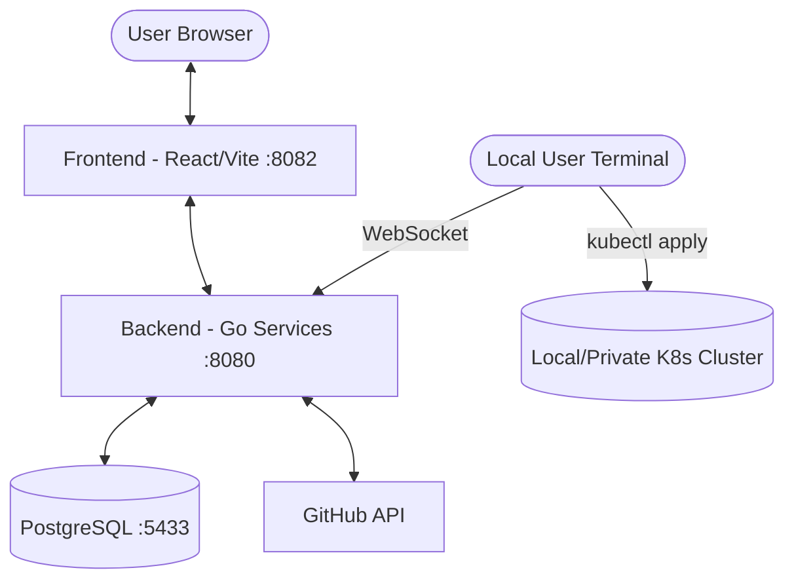

# Aegios Control Center

A modern, service-based Kubernetes security scanning and posture analysis platform. Aegios allows users to connect their GitHub repositories, scan for Kubernetes resources (including Helm charts), and analyze their security posture with AI-driven remediation suggestions. Furthermore, Aegios integrates an innovative **Kubernetes Terminal Agent** to facilitate zero-setup, secure point-and-click remediations natively from the dashboard directly into your local machine and clusters.

---

## 🌟 What is this project?

Aegios is built for developers and security engineers aiming to bridge the gap between identifying misconfigurations in declarative cluster states and executing actionable remediations instantly. By unifying your GitHub repository state with a holistic dashboard, Aegios automatically extracts and scores security vulnerabilities from your `.yaml` manifests and `Helm` charts, and maps out a roadmap towards a secure posture.

### Key Capabilities:
- **🔐 Secure Web Environment:** User authentication with GitHub PAT verification, maintaining high security standards.
- **📁 GitOps Auto-Scanning:** Immediate parsing of YAML and Helm files as repositories are imported.
- **📊 Posture & Scoring Metrics:** Complex evaluations map directly to a holistic security score (0-100).
- **🤖 Agentic AI Remediation:** Integration with GenAI to suggest and actively apply precise `kubectl` remediations.
- **🔌 Context-Aware Secure Reverse Proxy Agent:** Aegios ships with a bespoke WebSocket-based lightweight Terminal Agent (`agent.py`) so remote dashboard actions can securely modify local/isolated Kubernetes clusters (e.g. `docker-desktop`).

---

## 🏗️ System Architecture

Aegios is built using a modern service-based architecture, consisting of a React-based frontend, a high-performance Go backend, and local Python connection agents.



---

## 📁 Repository Structure

```tree
.
├── aegios-control-center-main/   # Frontend Application (React/Vite/Tailwind)
│   ├── src/                     # Source code & components
│   └── Dockerfile               # Frontend containerization
├── github-pat-backend/          # Backend Services (Go/Gin framework)
│   ├── pkg/                     # Shared standard libraries (db, responses)
│   ├── services/                # Handlers (Authentication, Fetching, Security)
│   └── Dockerfile               # Backend containerization
├── kube-connect-script/         # 🆕 Terminal Connection Agent resources
│   ├── agent.py                 # WebSocket local executing agent
│   └── kube-connect-script.sh   # Bash wrapper to deploy the connection
└── docker-compose.yml           # Multi-service local orchestration
```

---

## 🚀 How to Run the Project 

### Option A: Using Docker Compose (Recommended)

The fastest way to get Aegios running is by using Docker Compose. This automatically spins up the PostgreSQL database, Go backend services, and the React frontend environment.

**1. Prerequisites**
- Docker & Docker Desktop Installed.
- GitHub Personal Access Token (PAT) for importing your repositories over the UI.

**2. Launch the Platform**
```bash
# In the root repository directory
docker-compose up --build -d
```

**3. Access Environments**
- **Frontend UI**: [http://localhost:8082](http://localhost:8082)
- **Backend API Gateway**: [http://localhost:8080](http://localhost:8080)
- **PostgreSQL Database**: `localhost:5433`

### Option B: Running Manually

If you need to work on the code dynamically or separate the runtimes:
- **Database**: Run `docker-compose up postgres -d` to seed the db instance.
- **Backend**: Enter `./github-pat-backend/`. Setup a `.env` configuring `DB_HOST`, `DB_PORT`, `PORT` config. Run `go mod tidy` and `go run main.go`.
- **Frontend**: Enter `./aegios-control-center-main/`. Run `npm install` and `npm run dev`. Your app typically launches at `localhost:8081` (unless configured otherwise).

---

## 🖧 How to Implement & Run the Terminal Agent

Aegios recently deployed the **Terminal Action Agent**, which is a local script designed to securely connect your private Kubernetes clusters directly to the Aegios backend using WebSockets. When a user approves an "Agentic AI Fix" from the frontend dashboard, the command passes onto the active session stream and is run gracefully inside the local User's native isolated environment.

### Using the Automated Shell Wrapper
The easiest way to fire up the integration context is via the wrapper shell-script:

1. Validate you have `python3` and `kubectl` locally, configured towards a working cluster context (e.g. `docker-desktop`).
2. Run the script syntax providing the targeted Kube context and your secure session token (provided via Aegios dashboard):
   ```bash
   bash ./kube-connect-script/kube-connect-script.sh <kubernetes_context_name> <aegios_connection_token> [optional_backend_url]
   ```
   **Example:**
   ```bash
   bash ./kube-connect-script/kube-connect-script.sh docker-desktop "abc123token" http://localhost:8080
   ```
3. **What it does:** The script identifies the context, creates a minified transient `kubeconfig`, uploads minimal connection prerequisites to your backend session handler, and starts `agent.py` automatically.

### Running the Python Agent Manually
For granular testing or specific execution requirements, you can invoke the reverse WebSocket connection natively:

```bash
# Navigate to the script directory
cd kube-connect-script

# Run the python connection passing the session WS endpoint and token
python3 agent.py ws://localhost:8080/session/agent-ws <your_token_here>
```

Keep the terminal tab open while executing actions from your web dashboard. You will see live standard outputs streams mapping out execution logs dynamically in the terminal output.

---

**Last Updated**: April 2026
