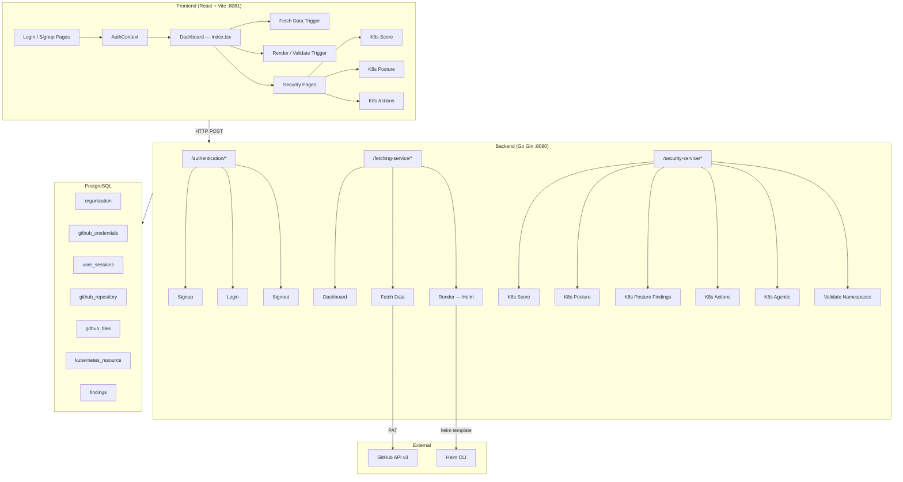
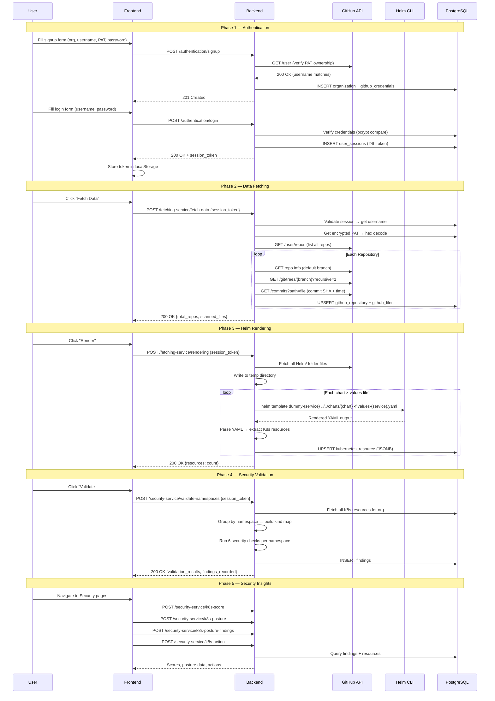
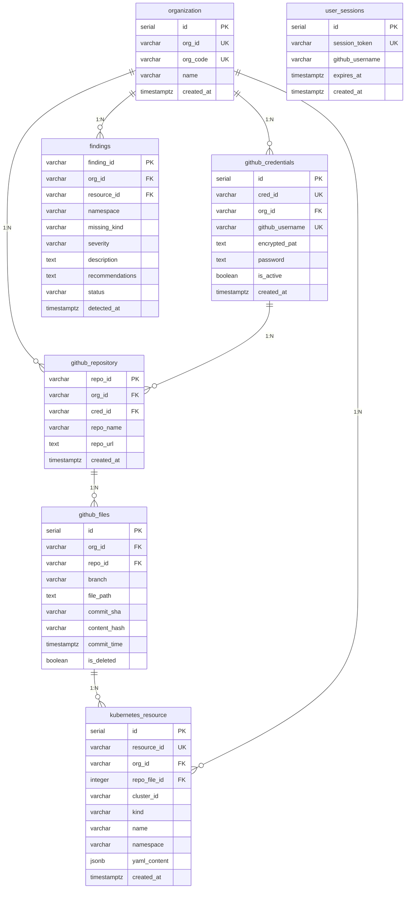

# Aegios – Kubernetes Security Posture Management (KSPM) Platform

## Project Overview

**Aegios** is a full-stack **Kubernetes Security Posture Management** platform that connects to a user's GitHub repositories via Personal Access Token (PAT), scans for Helm charts and Kubernetes manifest files, renders them, ingests the resulting K8s resources into a PostgreSQL database, and then runs **6 automated security checks** to generate findings, scores, and remediation actions.

| Layer | Tech Stack |
|-------|-----------|
| **Frontend** | React 18 + TypeScript + Vite + TailwindCSS + shadcn/ui |
| **Backend** | Go (Gin framework) — monolith with 3 service groups |
| **Database** | PostgreSQL (6 tables, auto-created on startup) |
| **External API** | GitHub REST API v3 |
| **Tooling** | Helm CLI (for `helm template` rendering) |
## Security Check Execution Path Verification

A complete architectural verification was performed against the explicit criteria defined in the user's provided images:

1.  **Kind Existence Check (Condition 1)**
    *   **Validated Path:** Runs *before* deep analysis loops globally. Ensures all 9 explicitly defined Kinds (Role, ClusterRole, RoleBinding, ClusterRoleBinding, ServiceAccount, Deployment, Secret, LimitRange, Service) are present in the namespace. Findings mapped perfectly to front-end UI categories.
2.  **Resource Misconfiguration (Condition 2)**
    *   **Validated Path:** Targets exclusively [Deployment](file:///e:/MAJOR-PROJECT/github-pat-backend/services/security-service/validation-service.go#776-841) kinds. Drills down through `spec.template.spec.containers.resources`. Validates `requests` and `limits` existence, `cpu` and `memory` specific declarations, and throws "high" severity if `requests > limits`.
3.  **Secret Misconfiguration**
    *   **Validated Path:** Analyzes env vars in deployments/daemonsets for plain text values (lacking `secretKeyRef`). Scans ConfigMaps for sensitive phrasing (password, key). Validates Secret data arrays for structural base-64 integrity.
4.  **Container Security**
    *   **Validated Path:** Extracts deployment/daemonset containers and explicitly checks for `privileged: true`, `runAsUser: 0`, and `allowPrivilegeEscalation: true`.
5.  **Service Exposure**
    *   **Validated Path:** Matches [Service](file:///e:/MAJOR-PROJECT/github-pat-backend/services/security-service/validation-service.go#919-947) to [Deployment](file:///e:/MAJOR-PROJECT/github-pat-backend/services/security-service/validation-service.go#776-841). Throws issues if `Service.type == NodePort`, `Service.selector` is empty, or if `targetPort` fails to match the Deployment container port exposing vulnerabilities.
6.  **Network Policy & RBAC**
    *   **Validated Path:** Detects if Network Policies use wildcard `{}` rules allowing unauthenticated ingress/egress. Scans Roles and ClusterRole for wildcard access privileges.

**Conclusion:** All six deep analytics modules accurately conform to the design schemas provided.
---

## Architecture Diagram



---

## Complete User Flow (End-to-End)



---

## Backend Deep-Dive

### 1. Authentication Service (`services/authentication/`)

| Endpoint | Handler | Logic |
|----------|---------|-------|
| `POST /authentication/signup` | [Signup()](file:///e:/MAJOR-PROJECT/github-pat-backend/services/authentication/signup.go#38-132) | Validates GitHub PAT against `api.github.com/user`, checks username ownership, generates org_id/cred_id, creates `organization` + `github_credentials` rows. Password hashed with **bcrypt**. PAT stored as **hex-encoded** string. |
| `POST /authentication/login` | [Login()](file:///e:/MAJOR-PROJECT/github-pat-backend/services/authentication/login.go#34-131) | Fetches credentials by username, verifies password with **bcrypt**, creates a **SHA-256 session token** with 24h expiry, inserts into `user_sessions`. Returns session_token + org details. |
| `POST /authentication/signout` | [Signout()](file:///e:/MAJOR-PROJECT/github-pat-backend/services/authentication/signout.go#16-46) | Deletes session from `user_sessions` where token matches and not expired. |

### 2. Fetching Service (`services/fetching-service/`)

| Endpoint | Handler | Logic |
|----------|---------|-------|
| `POST /fetching-service/dashboard` | [Dashboard()](file:///e:/MAJOR-PROJECT/github-pat-backend/services/fetching-service/dashboard.go#42-115) | Returns user info, org info, and aggregate stats (repos, files, K8s resources, findings counts). |
| `POST /fetching-service/fetch-data` | `FetchDataOptimized()` | **Incremental sync** — on first fetch, scans all YAML files (limit 50). On subsequent fetches, compares **commit_time → commit_sha → content_hash** to skip unchanged files. Stores metadata in `github_files`. |
| `POST /fetching-service/rendering` | [Render()](file:///e:/MAJOR-PROJECT/github-pat-backend/services/fetching-service/render.go#30-75) | Fetches [Helm/](file:///e:/MAJOR-PROJECT/github-pat-backend/pkg/parser/helm.go#9-37) folder from GitHub, writes to temp dir, runs `helm template` for each chart × values-file combination, parses rendered YAML into K8s resources, and upserts into `kubernetes_resource` table with JSONB content. |

**Key Incremental Sync Logic** ([fetch_data.go](file:///e:/MAJOR-PROJECT/github-pat-backend/services/fetching-service/fetch_data.go)):
1. If `commit_time` matches → **SKIP**
2. Else if `commit_sha` matches → **SKIP**  
3. Else if `content_hash` matches → **SKIP**
4. Else → **FETCH** (file changed)

### 3. Security Service (`services/security-service/`)

| Endpoint | Handler | Logic |
|----------|---------|-------|
| `POST /security-service/k8s-score` | [GetScore()](file:///e:/MAJOR-PROJECT/github-pat-backend/services/security-service/k8s_score.go#36-68) | Calculates weighted security score from findings: Critical=4, High=3, Medium=1, Low=1. Returns score %, grade (A–F), criticality level. |
| `POST /security-service/k8s-posture` | [GetPosture()](file:///e:/MAJOR-PROJECT/github-pat-backend/services/security-service/k8s_posture.go#27-131) | Analyzes each K8s resource using `analysis.AnalyzeResourcePosture()` — checks for privileged mode, root user, missing limits, host network, etc. |
| `POST /security-service/k8s-posture-findings` | [GetPostureFindings()](file:///e:/MAJOR-PROJECT/github-pat-backend/services/security-service/k8s_posture_findings.go#39-139) | Returns findings enriched with resource context via a **LATERAL JOIN** that matches findings to resources by resource_id, then namespace+kind, then namespace alone. |
| `POST /security-service/k8s-action` | [GetActions()](file:///e:/MAJOR-PROJECT/github-pat-backend/services/security-service/k8s_action.go#23-108) | Generates remediation actions per resource using `analysis.GenerateActions()`. |
| `POST /security-service/k8s-agentic` | [ApplyAgentic()](file:///e:/MAJOR-PROJECT/github-pat-backend/services/security-service/k8s_agentic.go#33-96) | Simulated NLP-driven remediation — parses user intent keywords, generates remediation plan, applies simulated changes (e.g., enforce_non_root, add_resource_limits, remove_privilege). |
| `POST /security-service/validate-namespaces` | [ValidateNamespaces()](file:///e:/MAJOR-PROJECT/github-pat-backend/services/security-service/validation-service.go#55-111) | **The core validation engine** — fetches all K8s resources, groups by namespace, checks for 8 required kinds, then runs **6 security checks**. |

#### The 6 Security Checks ([validation-service.go](file:///e:/MAJOR-PROJECT/github-pat-backend/services/security-service/validation-service.go))

| # | Check | What It Does | Severity |
|---|-------|-------------|----------|
| 1 | **Resource Misconfiguration** | Checks Deployments for missing CPU/memory requests/limits | Medium–High |
| 2 | **Secret Misconfiguration** | Detects plain-text env vars, sensitive ConfigMap keys, non-base64 Secret data | High–Critical |
| 3 | **Container Security** | Detects `privileged: true`, `runAsUser: 0`, `allowPrivilegeEscalation: true` | Critical–High |
| 4 | **Service Exposure** | Flags NodePort services, missing selectors, targetPort mismatches | Medium–High |
| 5 | **Network Policy** | Flags namespaces without any NetworkPolicy resources | Medium |
| 6 | **RBAC** | Checks for missing Role/ClusterRole/RoleBinding resources per namespace | Critical |

---

## Database Schema



---

## Frontend Structure

### Route Map

| Path | Component | Access |
|------|-----------|--------|
| `/authentication/login` | `LoginPage` | Public |
| `/authentication/signup` | `SignupPage` | Public |
| `/authentication/forgot-password` | `ForgotPasswordPage` | Public |
| `/fetching-service/dashboard` | `Index` (MainDashboard) | Protected |
| `/security-service/k8s-score` | `K8sScorePage` | Protected |
| `/security-service/k8s-posture` | [K8sPostureLanding](file:///e:/MAJOR-PROJECT/aegios-control-center-main/src/pages/security/K8sPostureLanding.tsx#47-126) | Protected |
| `/security-service/k8s-posture/:category` | `K8sCategoryPage` | Protected |
| `/security-service/k8s-action` | `K8sActionLanding` | Protected |
| `/security-service/k8s-action/:category` | `K8sActionCategoryPage` | Protected |

### Key Frontend Architecture

- **AuthContext** — Manages login/signup/logout, stores session_token in localStorage, dispatches `aegios:login` event
- **SecurityContext** — Fetches and caches all security data (score, posture, findings, actions) from backend
- **ProtectedRoute** — Guards routes, redirects to login if not authenticated
- **API Client** — Centralized HTTP client with timeout (10s), retry (3 attempts), exponential backoff
- **Data Transformers** — Transform backend responses for frontend consumption

### Security UI Components

12 specialized components: `ScoreVisuals`, `Scoreboard`, `SecurityOverview`, `ServiceCard`, `ActionCard`, `ActionsDetailBox`, `CommandInputArea`, `NamespaceGroupList`, `LeftSidebar`, `RightSidebar`, `ServiceMetaBox`, `SecurityLayout`

---

## Core Packages (Backend)

| Package | Files | Purpose |
|---------|-------|---------|
| `pkg/database` | [db.go](file:///e:/MAJOR-PROJECT/github-pat-backend/tmp_check_db.go), [session.go](file:///e:/MAJOR-PROJECT/github-pat-backend/pkg/database/session.go), [findings.go](file:///e:/MAJOR-PROJECT/github-pat-backend/pkg/database/findings.go), [credentials.go](file:///e:/MAJOR-PROJECT/github-pat-backend/pkg/database/credentials.go), [files.go](file:///e:/MAJOR-PROJECT/github-pat-backend/pkg/database/files.go), [kubernetes.go](file:///e:/MAJOR-PROJECT/github-pat-backend/pkg/database/kubernetes.go), [organization.go](file:///e:/MAJOR-PROJECT/github-pat-backend/pkg/database/organization.go), [repository.go](file:///e:/MAJOR-PROJECT/github-pat-backend/pkg/database/repository.go) | PostgreSQL operations, table creation, session management, CRUD for all entities |
| `pkg/analysis` | [posture.go](file:///e:/MAJOR-PROJECT/github-pat-backend/pkg/analysis/posture.go), [score.go](file:///e:/MAJOR-PROJECT/github-pat-backend/pkg/analysis/score.go), [action.go](file:///e:/MAJOR-PROJECT/github-pat-backend/pkg/analysis/action.go) | Security analysis engines — posture checks, scoring (0–100), action generation |
| `pkg/parser` | [parser.go](file:///e:/MAJOR-PROJECT/github-pat-backend/pkg/parser/parser.go), [helm.go](file:///e:/MAJOR-PROJECT/github-pat-backend/pkg/parser/helm.go) | YAML/K8s manifest parser, Helm template detector and basic renderer with default values |
| `pkg/logger` | [logger.go](file:///e:/MAJOR-PROJECT/github-pat-backend/pkg/logger/logger.go) | Structured logging utility |
| `pkg/response` | [response.go](file:///e:/MAJOR-PROJECT/github-pat-backend/pkg/response/response.go) | Standardized API response format (`{success, data, message}`) |
| `pkg/helm` | — | Helm-related utilities |

---

## Security Scoring Formula

```
Score = ((maxWeight - totalWeight) / maxWeight) × 100

Where:
  maxWeight = totalFindings × 4
  totalWeight = Σ(critical×4 + high×3 + medium×1 + low×1)

Grade: ≥90→A, ≥80→B, ≥70→C, ≥60→D, <60→F
Criticality: ≥80→Low, ≥60→Medium, <60→High
```
